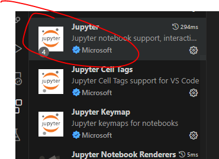
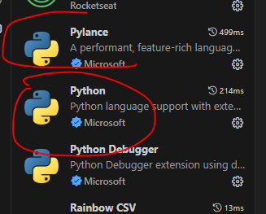
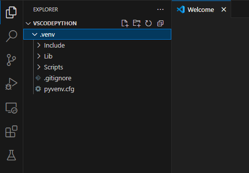
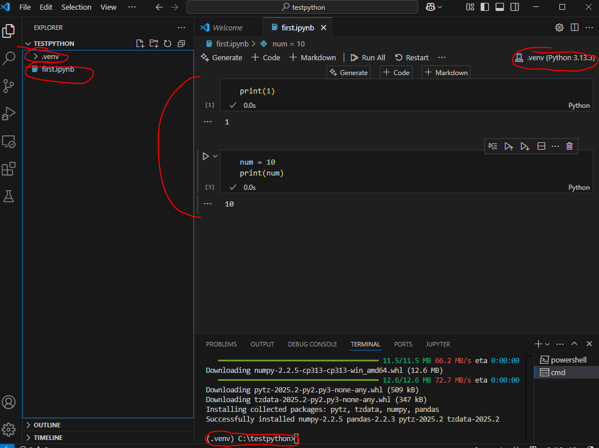

# 주피터와 비슷하게 VScode에서도 쓰기
#### .Venv 를 이용해서 VScode에서도 Jupyter Notebook이랑 유사한 환경을 만들어서 작업할 수 있게 만들어보는 것이다. 

---
1. 먼저 파이썬 최신버전을 깔고 %PATH% 설정까지 해준다.
2. vscode 확장팩 Extensions에서 jupyter와 python을 다운받아준다.

3. "Ctrl + Shift + p"를 눌러서 Python select environment와 Python select interpreter에서 .Venv로 설정해준다.
4. 그리고 환경 구성이 제대로 안된다면 처음 설치했던 파이썬 installer를 다시 실행하고 Repair 옵션을 선택해서 실행하고 3.번 매뉴얼을 다시 해본다. 
5. 다 되었다면 .ipynb확장자 파일을 만들고 오른쪽 상단에 kernel을 선택해주고 사용해본다. 잘 실행 된다면 이런 모습일거다.
--- 

이것은 .venv설정이 완료 되었을때 파일 구성도 이다.

* 이러면 설정 완료다. 